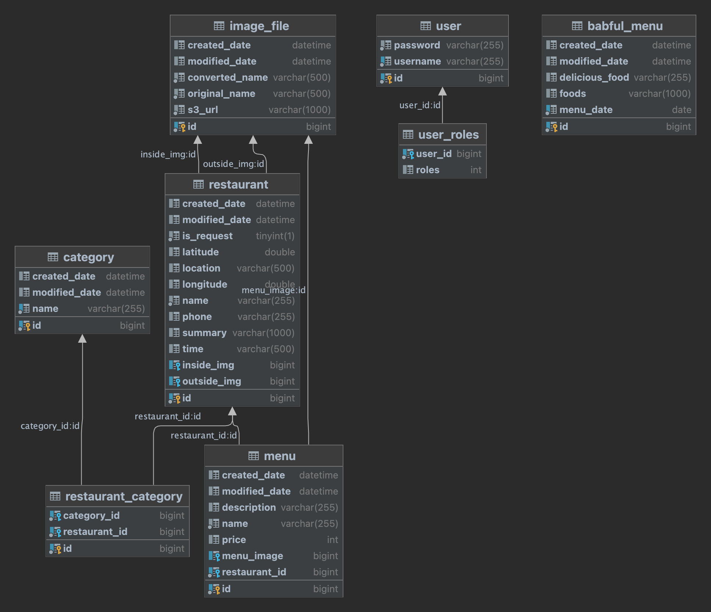
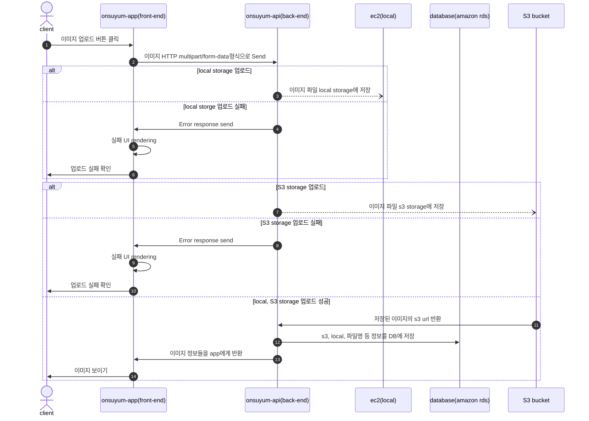
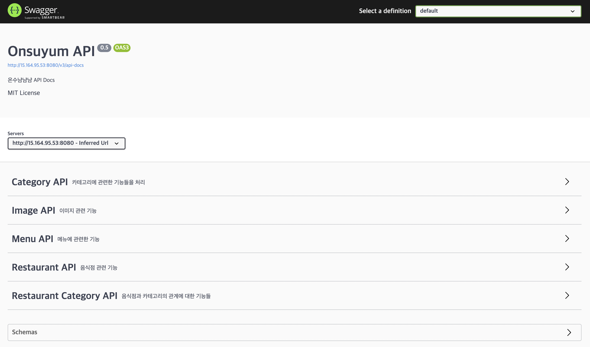

# OnsuYumYumYum Server
온수역 맛집 소개 서비스 2탄 API Server

## Introduce
이 서비스는 [온수냠냠냠](https://www.onsuyum.com/)을 위한 Api 서버입니다.

## Development environment

- 개발 환경 : macOS(arm-M1)
- 개발 도구 : IntelliJ
- 사용 언어 : Java([openJDK 11 - zulu 11.0.15 LTS](https://www.azul.com/downloads/?package=jdk#download-openjdk))
- 데이터베이스 : Mysql(배포), H2 database(개발)

## Getting start

[온수냠냠냠 API](https://api.onsuyum.com/)

## Used Teck stack

## Database ERD

수정 가능성 있음

## Sequence Diagram

### Upload

온수냠냠냠 API는 이미지 파일 S3 bucket과 EC2(local)로 저장을 합니다.

<!-- ### Cache -->

## Api docs

* Swagger를 이용한 문서 자동화

## License
OnsuYumYumYum Server는 MIT License를 적용했습니다.

## Open Source

* [https://github.com/tsparticles/404-templates](https://github.com/tsparticles/404-templates)
